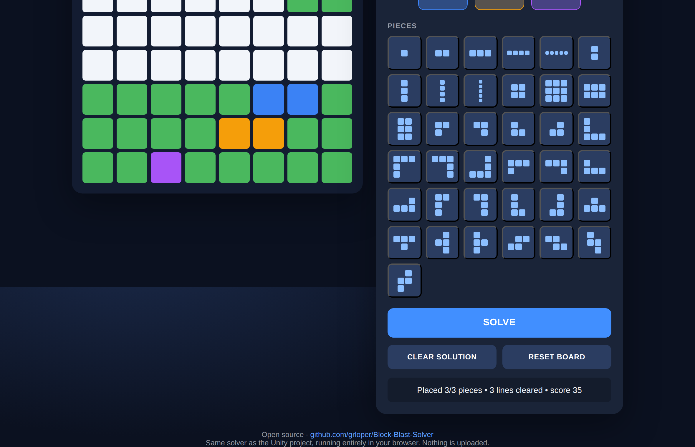
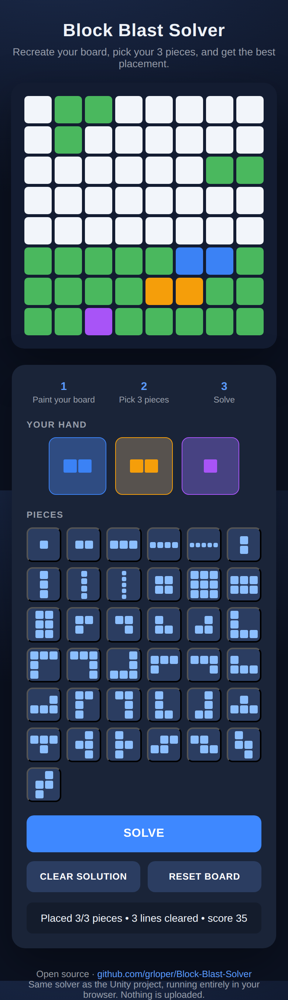

# Block Blast Solver

A tool that finds the best way to play your next hand in **Block Blast**.
Recreate your in-game board on an 8x8 grid, pick the three pieces you were
dealt, and hit **Solve** - it searches every placement order and position,
simulates the line clears, and shows you the highest-scoring sequence.

Built in Unity, and also shipped as a zero-install browser app so it runs on
**any device - Windows, macOS, Android and iPhone**.

## ▶ Play now (any device, no install)

**[Open the solver in your browser](https://grloper.github.io/Block-Blast-Solver/)**

Works on desktop and mobile - just open the link and start painting your board.
Everything runs locally in your browser; nothing is uploaded.

| Desktop | Mobile |
| :---: | :---: |
|  |  |

> The live link goes live once this branch is merged to `main` and GitHub Pages
> is enabled (see [Enabling the live web app](#enabling-the-live-web-app)).

## ⬇ Download the native app

Prefer a real installed app? Each tagged release ships native builds you can
download and run:

| Platform | File | How to run |
| --- | --- | --- |
| **Windows** | `BlockBlastSolver-StandaloneWindows64.zip` | Unzip, run `BlockBlastSolver.exe` |
| **macOS** | `BlockBlastSolver-StandaloneOSX.zip` | Unzip, open `BlockBlastSolver.app` |
| **Linux** | `BlockBlastSolver-StandaloneLinux64.zip` | Unzip, run `BlockBlastSolver` |
| **Web (self-host)** | `BlockBlastSolver-WebGL.zip` | Serve the folder with any static web server |

Grab the latest from the **[Releases page](https://github.com/grloper/Block-Blast-Solver/releases)**.

> **iPhone / iPad:** a native App Store build needs an Apple Developer account
> and code signing, so it isn't distributed here - use the **[browser version](https://grloper.github.io/Block-Blast-Solver/)**
> instead. It runs great in Safari and can be added to your Home Screen
> (Share → *Add to Home Screen*) to feel like a native app.

## How to use it

1. **Paint your board** - click / drag (or tap / drag on touch) to mark the
   cells that are blocked in your game. Dragging over painted cells erases.
2. **Pick your pieces** - choose up to 3 pieces from the palette. Tap a hand
   slot to remove a piece.
3. **Solve** - the best placement for each piece is overlaid on the board:
   blue = 1st piece, orange = 2nd, purple = 3rd. The status line reports pieces
   placed, lines cleared, and the score of the sequence.

## How the solver works

The core is a pure, engine-independent search (`BlockBlastSolver.cs`, mirrored
one-to-one in the web app):

- Tries every **ordering** of the selected pieces (order matters - clearing a
  line first can open space for the next piece) and every board position.
- After each placement it **simulates Block Blast's clearing rule**: full rows
  and columns clear simultaneously, so cascades are searched too.
- Scores each sequence (1 point per cell placed, +10 per cleared line, plus a
  combo bonus for multi-line clears) and keeps the best one. If not every piece
  fits, the sequence placing the most pieces wins.

The full search for 3 pieces finishes in well under a second.

## Project structure

| Path | Purpose |
| --- | --- |
| `Assets/Scripts/BoardSetup.cs` | Spawns the 8x8 tile grid |
| `Assets/Scripts/TileController.cs` | Click/drag painting and preview colors for a single tile |
| `Assets/Scripts/BoardManager.cs` | Board state access, previews, reset |
| `Assets/Scripts/PieceLibrary.cs` | The 37 standard Block Blast piece shapes |
| `Assets/Scripts/BlockBlastSolver.cs` | The placement search (pure C#, engine-independent) |
| `Assets/Scripts/SolverController.cs` | Builds the whole solver UI at runtime and wires everything together |
| `WebApp/index.html` | Self-contained browser version (same solver, mobile/touch ready) |
| `.github/workflows/deploy-web.yml` | Publishes the browser app to GitHub Pages |
| `.github/workflows/unity-build.yml` | Builds native Windows/macOS/Linux/WebGL players to Releases |

## Run from source (Unity)

1. Open the project in **Unity 6000.0.32f1** (or newer).
2. Open `Assets/Scenes/SampleScene.unity`.
3. Press **Play**. No scene setup is needed - `SolverController` builds the
   piece palette, hand slots, and buttons at runtime and frames the camera
   automatically.

## Maintainer setup

### How the live web app is hosted

GitHub Pages serves the site straight from the `main` branch
(**Settings → Pages → Source: Deploy from a branch → `main` / `(root)`**), which
rebuilds automatically on every push. A root `index.html` redirects visitors to
`WebApp/`, and `.nojekyll` makes every file serve as-is. So the play link is:

`https://grloper.github.io/Block-Blast-Solver/` → redirects to the app.

Prefer an Actions-based deploy instead? Switch the Pages **Source** to
**GitHub Actions** and run the optional `deploy-web.yml` workflow (Actions tab →
*Run workflow*).

### Enabling native release builds

The `unity-build.yml` workflow builds the native players. Unity requires a
license to build in CI (a free Personal license works):

1. Get an activation file by following [GameCI activation](https://game.ci/docs/github/activation).
2. Add these **repository secrets** (Settings → Secrets and variables → Actions):
   - `UNITY_LICENSE` - contents of your `.ulf` activation file
   - `UNITY_EMAIL` - your Unity account email
   - `UNITY_PASSWORD` - your Unity account password
3. Cut a release build by pushing a tag:
   ```bash
   git tag v1.0.0
   git push origin v1.0.0
   ```
   The zipped Windows, macOS, Linux and WebGL builds are attached to the
   Release automatically.

## License

Open source under the [MIT License](LICENSE).
